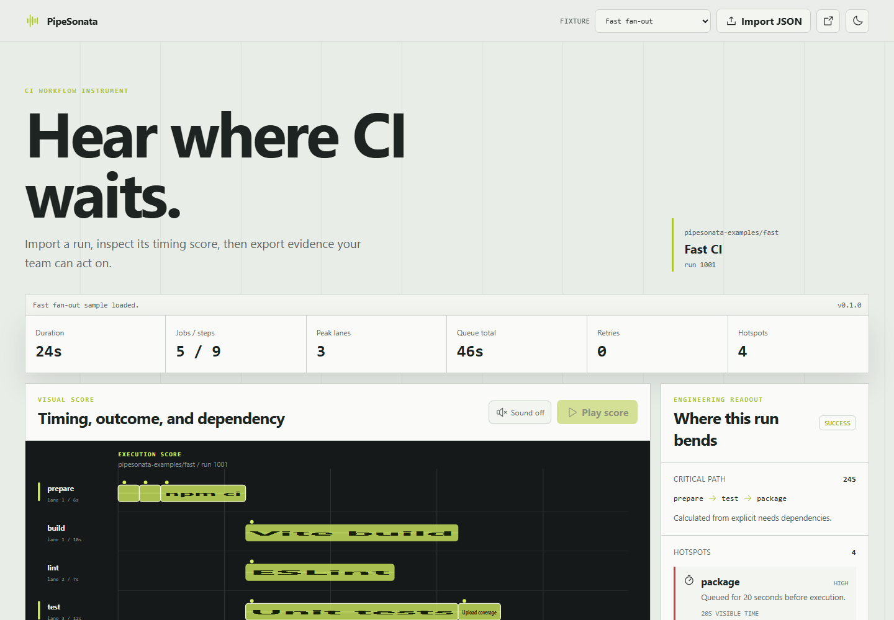

# PipeSonata

[](https://github.com/KanadeK/pipesonata/actions/workflows/ci.yml)
[](https://github.com/KanadeK/pipesonata/actions/workflows/security.yml)
[](https://github.com/KanadeK/pipesonata/releases)
[](LICENSE)

**Hear where CI waits.** PipeSonata turns GitHub Actions run timing, queueing, retries, failures,
and concurrency into one inspectable visual score, an optional WebAudio performance, and
engineering evidence you can export.

[Live demo](https://kanadek.github.io/pipesonata/) ·
[中文说明](README.zh-CN.md) ·
[Input format](docs/INPUT_FORMAT.md) ·
[Privacy and security](docs/PRIVACY_AND_SECURITY.md)



## Why PipeSonata

CI dashboards tell you whether a run passed. PipeSonata is a local-first instrument for asking
where the run waited and which sequence constrained completion.

- Parses a combined GitHub Actions run or a run/jobs response pair with Zod.
- Preserves job and step timing, queue time, attempts, retry counts, status, and conclusion.
- Calculates observed parallelism and a dependency-aware critical path.
- Flags repeated installs, unstable attempts, failed work, and material queueing.
- Renders the same deterministic analysis as a D3 timeline and WebAudio note schedule.
- Exports SVG, 2x PNG, MIDI-like note JSON, and a credential-redacted Markdown report.
- Keeps imported files in the browser tab. There is no upload endpoint, analytics, or telemetry.

The three checked-in fixtures cover a fast fan-out, a serial bottleneck, and a flaky browser suite.
Their expected critical path, peak parallelism, and conclusion are asserted in integration tests.

## Quick start

Requirements: Node.js 22.12 or newer and npm.

```bash
git clone https://github.com/KanadeK/pipesonata.git
cd pipesonata
npm ci
npm run dev
```

Open the printed local URL. The fast fixture loads without network access. Choose another fixture,
select one combined JSON file, or select a GitHub run response and jobs response together.

To exercise the production build and generate real exports:

```bash
npm run demo
```

This writes four generated files to `demo-output/` and refreshes the checked-in README screenshot.
See [Reproducible demo](docs/DEMO.md) for the generated file list and manual acceptance steps.

## Import GitHub Actions data

PipeSonata accepts:

1. A combined object with `run` and `jobs`, like the files in [`examples/`](examples/).
2. One standard GitHub workflow run response plus one standard jobs response, selected together.

With the GitHub CLI:

```bash
gh api repos/OWNER/REPOSITORY/actions/runs/RUN_ID > run.json
gh api "repos/OWNER/REPOSITORY/actions/runs/RUN_ID/jobs?filter=all&per_page=100" > jobs.json
```

Select both files in the import dialog. A run response by itself does not contain step timing or
dependency data, so PipeSonata reports that omission instead of inventing a graph.

See [Input format](docs/INPUT_FORMAT.md) for accepted fields, limits, dependency metadata, and
failure behavior.

## Read the score

| Signal               | Visual mapping                                       | Audio mapping                                    |
| -------------------- | ---------------------------------------------------- | ------------------------------------------------ |
| Job                  | One labeled row                                      | Instrument channel                               |
| Step timing          | Horizontal block from observed start to finish       | Note start and duration                          |
| Success              | Acid-lime block                                      | C minor pentatonic pitch                         |
| Failure or timeout   | Coral block                                          | Lower sawtooth note and failure cadence          |
| Critical path        | Bright outline and left marker                       | Stable channel assignment                        |
| Queueing and retries | Summary metrics and ranked engineering hotspot cards | Preserved in the exported note source and report |

Sound starts disabled. Playback requires an explicit click and uses only the browser's WebAudio
API. The timing is compressed so long workflows remain practical to review.

## Outputs

| Output             | Purpose                                                                   |
| ------------------ | ------------------------------------------------------------------------- |
| SVG score          | Editable, accessible vector timeline with labels and tooltips             |
| PNG score          | Shareable 2x raster export with the active theme background               |
| MIDI-like JSON     | Stable note schedule with pitch, MIDI number, channel, velocity, and time |
| Engineering report | Markdown summary of duration, concurrency, critical path, and hotspots    |

All outputs derive from the same immutable `WorkflowAnalysis`. Details and schemas are in
[Output formats](docs/OUTPUT_FORMATS.md).

## Deterministic examples

| Fixture                                                     | Jobs / steps | Expected critical path                                 | Peak lanes | Result  |
| ----------------------------------------------------------- | -----------: | ------------------------------------------------------ | ---------: | ------- |
| [`fast.json`](examples/fast.json)                           |        5 / 9 | `prepare -> test -> package`                           |          3 | success |
| [`serial-bottleneck.json`](examples/serial-bottleneck.json) |        5 / 8 | `prepare -> compile -> unit -> integration -> package` |          1 | success |
| [`flaky.json`](examples/flaky.json)                         |        4 / 8 | `prepare -> e2e -> report`                             |          2 | failure |

The fixtures are synthetic and MIT-licensed. They contain no production data or credentials.

## Architecture

```text
GitHub Actions JSON or deterministic fixture
                    |
              input adapters
                    |
       Zod-validated normalized model
                    |
     timing, lanes, critical path, hotspots
                    |
          deterministic score model
             /                 \
      D3 visual             WebAudio
             \                 /
       SVG, PNG, note JSON, Markdown
```

Pure domain code lives in `src/core/`; external representations enter through `src/adapters/`;
browser services and components live in `src/features/`. The UI, audio engine, and exporters never
recompute workflow semantics. See [Architecture](docs/ARCHITECTURE.md) for invariants and extension
boundaries.

## Development and verification

```bash
npm ci
npm run format:check
npm run lint
npm run typecheck
npm run test:unit
npm run test:integration
npm run test:coverage
npm run test:e2e
npm run build
npm run benchmark
```

The release entry points used by CI are:

```bash
npm run verify
npm run audit:dependencies
npm run package
npm run release-check
```

`verify` executes eight local quality gates. `package` creates versioned static, demo, source, SBOM,
provenance, and checksum assets. `release-check` validates the initial milestone history, author and
committer identity, archive contents, checksums, clean provenance, and a browser smoke test from the
extracted static archive.

The current suite has 33 Vitest tests and 5 real Chromium paths. Core coverage is 99.01% lines,
100% functions, 90.5% branches, and 99.04% statements on the release baseline. Coverage gates are
80% for every metric. See [Benchmark](docs/BENCHMARK.md) for the reproducible microbenchmark method
and measured results.

## Privacy and threat boundary

- Imports are read with the browser `File` API and are never uploaded.
- Common bearer tokens, JWTs, URL credentials, passwords, cookies, and secret assignments are
  redacted from Markdown reports.
- Repository names, commit identifiers, actor names, and internal job names are not inherently
  secrets. Review exports before sharing.
- The static application uses no account, backend, analytics, advertising, or persistent token
  store.

See [Privacy and security](docs/PRIVACY_AND_SECURITY.md) and [SECURITY.md](SECURITY.md).

## Scope and limitations

Version 0.1.0 intentionally analyzes one completed or in-progress run at a time. It does not poll
GitHub, compare historical runs, claim root cause, play Standard MIDI Files, or infer missing
`needs` relationships. When dependency metadata is absent, the critical path is clearly labeled as
a lower bound.

Current GitHub jobs endpoints may require pagination beyond 100 jobs. Exported PNG quality depends
on browser canvas support. Audio is an interpretive aid, not an accessibility replacement for the
visual and textual outputs.

## Differentiation

A public repository scan found adjacent workflow dashboards, telemetry collectors, visualizers,
and general sonification tools, but no exact-name repository or highly isomorphic active MVP.
PipeSonata keeps three explicit boundaries: deterministic offline input, one model for visual and
audio evidence, and engineering diagnostics beside the artistic representation. The scan is
documented in [Competitor scan](docs/COMPETITOR_SCAN.md); it is not a claim of global uniqueness.

## Roadmap

- Historical run comparison with explicit data provenance.
- Optional GitHub adapter using short-lived, minimum-scope credentials.
- Standard MIDI File export and richer accessible score narration.
- Web Worker analysis for very large job graphs.

## FAQ

**Does PipeSonata send my workflow data anywhere?**
No. The shipped static app has no upload endpoint. Browser developer tools can verify that imported
fixture analysis requires no network request.

**Why does PipeSonata ask for two GitHub API files?**
The run endpoint describes the workflow run, while the jobs endpoint contains jobs and steps. A
combined fixture is also accepted.

**Is the reported critical path always exact?**
It is exact for the supplied `needs` graph and observed durations. Without dependency metadata,
PipeSonata reports the longest observed job as a lower bound.

**Can I use the audio in an automated pipeline?**
The browser playback needs a user gesture. Use the deterministic note JSON export for downstream
automation.

## Contributing and license

Focused issues and pull requests are welcome. Read [CONTRIBUTING.md](CONTRIBUTING.md) and the
[Code of Conduct](CODE_OF_CONDUCT.md). Security reports follow [SECURITY.md](SECURITY.md).
Maintainers can follow [Releasing](docs/RELEASING.md).

PipeSonata is released under the [MIT License](LICENSE).
